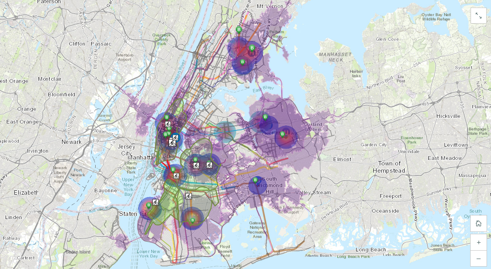

# NYC-COVID19-Transit-RiskZones
An ArcGIS map visualizing transportation methods used by patients leaving medical facilities in NYC during the COVID-19 PAUSE order, highlighting potential risk zones based on transit ridership and mobility patterns.
  

## Live Demo
🔗 [Link to ArcGIS StoryMaps](https://storymaps.arcgis.com/stories/e4572d7373054bd0b057c77f6875859e)
  

## Context
This project examines transportation patterns of patients leaving healthcare facilities in New York City during the COVID-19 PAUSE order (March-April 2020). The aim is to understand mobility trends, particularly the risk zones that emerged from transit choices, which could have contributed to the spread of the virus. By integrating various data sources, including ridership information from NYC’s TLC and Todd Schneider, Uber ride data, and healthcare center locations in KMZ files, the analysis highlights subway stations, bus stops, bike lanes, and CitiBike risk zones. This map serves as an introductory exploration of post-discharge mobility, offering insights into how transportation choices around healthcare centers may have played a role in virus transmission during the pandemic. Limitations include the reliance on secondary data sources, such as ridership figures, and the absence of detailed patient-level information, which would provide a more granular understanding of individual behavior. 

Word Count: 143 words
  

## Results and Analysis
The analysis provides a detailed view of transportation choices and potential risk zones around healthcare centers in NYC during the peak of the COVID-19 pandemic. The map highlights areas with the highest subway and bus ridership, showing significant concentration around key healthcare centers, which could indicate higher patient mobility in those regions. The purple zones represent 13-minute Uber rides, with a distance of 5.41 miles, reflecting common travel durations for those leaving medical facilities. These zones help pinpoint areas where patients may have been more likely to use rideshare services, increasing the potential for virus transmission in transit. The map also identifies CitiBike risk zones, calculated based on the average travel distance of 2.6 miles per user, signaling areas where cycling could present risks to individuals exposed to the virus. Subway routes and bike lanes are mapped to further contextualize transportation choices. While these findings offer a useful overview, they are limited by the use of secondary data sources and the inability to track individual patient journeys, leaving room for more detailed, patient-level analysis in future studies.

Word Count: 177 words
  

## Preview

  

## Software Used
- **ArcGIS**
